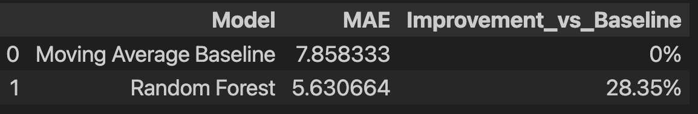

# VIKMO Dealer Assistant

## Overview

This project implements a conversational AI assistant for auto-parts dealers.

The assistant can:

- Retrieve relevant products from the catalogue.
- Check stock availability.
- Find parts by vehicle.
- Create structured orders.
- Maintain conversation context across multiple turns.
- The system uses Retrieval-Augmented Generation (RAG) with FAISS vector search and Gemini for conversational interaction.

---

## Tech Stack

- Python
- Google Gemini 2.5 Flash
- LangChain
- FAISS
- HuggingFace Embeddings
- Pandas

---

## Project Structure

```text
assistant/
evaluation/
data/
README.md
DESIGN.md
requirements.txt
```

---

## Setup

Install dependencies:

```bash
pip install -r requirements.txt
```

Create a `.env` file:

```env
GOOGLE_API_KEY=your_api_key
```

---

## Running the Assistant

```bash
python -m assistant.agent
```

---

## Running Evaluation

```bash
python evaluation/run_eval.py
```

---

## Example Queries

```text
Do you have brake pads for Bajaj Pulsar 150?

Check stock for BRK-1002

I need tyres

What's the weather today?
```

---

## Example Interaction

User:
Show Bosch products

Assistant:
Returns Bosch products retrieved from the catalogue.

User:
Check stock for BRK-1049

Assistant:
We have 130 units of BRK-1049 in stock.

## Assumptions

- Product information is sourced from the provided catalogue.
- Stock information is retrieved from catalogue data.
- The assistant is restricted to auto-parts related queries.
- Conversation history is maintained during the active session to support multi-turn conversations.
- Evaluation results are based on the included evaluation suite.

---

## Evaluation Results

Total Tests: 10

Passed: 10

Accuracy: 100%

See:

- DESIGN.md
- evaluation/results.md

for additional details.


## Demand Forecasting Results

Baseline MAE: 7.85

Random Forest MAE: 5.62

[Model Comparison](demo_screenshots/model comparison.png)

Improvement over baseline: 28.35%

The forecasting model was trained using:

- lag_1
- lag_2
- lag_3
- lag_4
- rolling_mean_4
- promo_flag

Future forecasts are available in:

forecast_next_4_weeks.csv

### Feature Importance

Feature importance analysis showed that recent demand trends were the strongest predictors of future sales.

- rolling_mean_4 → 68.7%
- promo_flag → 16.4%
- lag features → remaining importance



## Tool Calling

The assistant uses Gemini 2.5 Flash function calling.

Gemini can invoke:

- check_stock
- find_parts_by_vehicle
- create_order

Tool outputs are executed in Python and returned to Gemini for grounded responses.


## Optional Chat UI

Run:

streamlit run app.py

This launches a chat-style interface for interacting with the VIKMO Dealer Assistant.